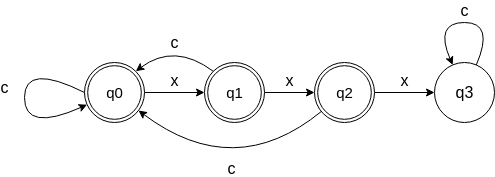

# PASO DE MARKDOWN A HTML
---
- **Becerra Burgos, Alejandro**
- **Mateos Romero, David**
---
## ÍNDICE
1. **Introducción**
2. **Desarrollo de la aplicación**
	- **Planteamiento**
	- **Plantilla**
		- **Sección de Declaraciones**
		- **Sección de Reglas**
		- **Sección de Procedimientos de Usuario**
	- **Generación del código fuente**
3. **Ejemplo de ejecución**


## 1. INTRODUCCIÓN
Markdown es un lenguaje de marcado que facilita la aplicación de formato a un texto empleando una serie de caracteres de una forma especial. Por otro lado, HTML es un lenguaje de marcado que se utiliza para el desarrollo de páginas de Internet. En esta memoria se explicará con completo detalle el desarrollo de una aplicación que convierte archivos Markdown (extensión _.md_) en archivos HTML.

La aplicación ha sido creada en lenguaje C++ mediante el uso del generador de analizadores léxicos _flex_. _flex_ se apoya en una plantilla que recibe como parámetro y, a partir de ella, genera el código fuente. La estructura de la plantilla se compone de tres secciones: sección de Declaraciones, sección de Reglas y sección de Procedimientos de Usuario.


## 2. DESARROLLO DE LA APLICACIÓN
## - Planteamiento
En primer lugar, tenemos que tener claro el funcionamiento que presentará la aplicación a desarrollar. Queremos que la aplicación reciba un archivo Markdown y que, a partir de este, genere un archivo equivalente en formato HTML. Las funcionalidades del lenguaje Markdown que vamos a implementar son, entre otras, marcado en negrita, cursiva, tachado, citas, códigos, links y títulos.

Todo el desarrollo de la aplicación recae sobre la creación de la plantilla sobre la cual se apoyará *flex* para generar el código fuente.

## - Plantilla

Como la aplicación solo recibirá un fichero de entrada, podemos omitir la llamada a yywrap() con la opción noyywrap, obteniendo así una mejora de eficiencia. Para el desarrollo de está aplicación será necesario la implementación de las tres secciones de una estructura de plantilla *flex*, las cuales se detallan a continuación.

### Sección de Declaraciones
- **Bloque de copia**

En este bloque le indicaremos al pre-procesador que lo que estamos definiendo queremos que aparezca “tal cual” en el fichero C++ generado.

Es un bloque delimitado por las secuencias %{ y %} donde podemos indicar la inclusión de los ficheros de cabecera necesarios, la declaración de variables globales y las declaraciones de procedimientos descritos en la sección de Procedimientos de Usuario.

En este bloque necesitaremos incluir:
- Ficheros de cabecera: `iostream, fstream, string, stack`
- Variables globales:
	- `ofstream out`- Será nuestro flujo de salida para la escritura del fichero HTML.
	- `bool quote, bold, italic, strike` - Una variable global booleana para algunas funcionalidades de markdown que pueden ser anidadas y que requieren trato especial. Hablaremos más a fondo de este trato en la sección de Reglas.
	- `int header`- Indicará el tipo de título que hay abierto en ese instante, para luego cerrarlo.
	- `stack<string> listas` - Si hay listas anidadas necesitamos saber en qué orden cerrarlas.
- Procedimientos:
	- `string substr(const  char* s, size_t pos, size_t len = string::npos)`
	Procedimiento que usaremos para obtener subcadenas de _yytext_.
	- `bool  handle_list(const  char* yytext, bool ordered)`
	Procedimiento que usaremos para añadir un elemento a una lista, cerrando los elementos y las listas anteriores en caso necesario.
	- `bool  end_lists(int n =  0)`
	Cierra las listas que haya abiertas hasta que solo queden _n_.
	- `void  set_header(int n)`
	Añade la etiqueta inicial de un título.
	- `bool  end_headers()`
	Añadir la etiqueta final de un título en caso de que sea necesario.
	- `void  escape_html(string& s)`
	Reemplaza los caracteres de _s_ que son reservados para HTML por su representación adecuada.

Por tanto, el bloque de copia nos quedaría de la siguiente forma:
```C++
%{
#include  <iostream>
#include  <fstream>
#include  <stack>
#include  <string>

using  namespace std;

ofstream out;
bool quote, bold, italic, strike;
int header;
stack<string> listas;

string  substr(const  char* s, size_t pos, size_t len = string::npos);
bool  handle_list(const  char* yytext, bool ordered);
bool  end_lists(int n =  0);
void  set_header(int n);
bool  end_headers();
void  escape_html(string& s);
%}
```

- **Bloque de definición de alias**

En este bloque definiremos las expresiones regulares necesarias para identificar las distintas funcionalidades de Markdown que queremos implementar.

Es necesario que al principio de cada línea aparezca el nombre con el cual queremos identificar la expresión regular, seguido de la propia expresión regular con **al menos** una tabulación.

En este bloque incluimos:
- `BOLD \*\*.+\*\*`  y `BOLD_END \*\*` para poder identificar las cadenas en **negrita**: una sucesión de caracteres delimitada por dos asteriscos antes y después.
- `ITALIC (\_[^\*]+\_)|(\*[^\*]+\*)` y `ITALIC_END \_|\*` para poder identificar las cadenas en *cursiva*: una sucesión de caracteres delimitada por un asterisco antes y después.
- `STRIKETHROUGH \~\~.+\~\~` y `STRIKETHROUGH_END \~\~` para poder identificar las cadenas ~~tachadas~~: una sucesión de caracteres delimitada por dos virgulillas antes y después.
- `BLOCKQUOTE ^\>` para poder identificar las citas, que comienzan con un signo "mayor que", y se extienden hasta que se encuentren dos saltos de línea.
> Ejemplo de cita
- `LINK \[.*\]\(.*\)` y `LINK_END \]\(.*\)` para identificar los [links](https://stackedit.io/): sucesión de caracteres delimitada por corchetes (texto) seguida de sucesión de caracteres delimitada por paréntesis (enlace).
- `PAD " "*` para identificar espacios en blanco.
- `LINE_1 ({PAD}\-{PAD}){3,}\n` y `LINE_2 ({PAD}\*{PAD}){3,}\n` para poder identificar las líneas: sucesiones de mínimo tres guiones o asteriscos con posibles espacios en medio. Ejemplo:
- --
- `LINE {LINE_1}|{LINE_2}` para identificar los dos tipos de línea descritos anteriormente (guiones o asteriscos).
- `HEADING ^#{1,6}` para poder identificar los distintos tipos de títulos, que comienzan con una sucesión de como mucho seis almohadillas, y terminan con un salto de línea.
- `IMAGE \!{LINK}` para poder identificar las imágenes, que son iguales que los enlaces pero con una exclamación al inicio.
- `UNORDERED_LIST ^\t*\-" "` para poder identificar las listas no enumeradas: sucesión de tabuladores posiblemente nula para los casos de listas anidadas seguida de un guión y un espacio.
- `ORDERED_LIST ^\t*[0-9]+\." "` para poder identificar las listas enumeradas: idénticas a las no enumeradas pero con un número en vez de un guión. Markdown ignora ese número y simplementa numera en orden ascendente.
- Para la identificación de código incluimos 5 expresiones regulares distintas debido a la gran diversidad presentada por Markdown en este ámbito, así como su complejidad de implementación.
```
CODE_1_LINE_CONTENT				(`{0,2}[^`])*`{0,2}
CODE_1_LINE					```{CODE_1_LINE_CONTENT}```
CODE_1 						^```.*\n(.|\n)*```\n

CODE_2_CONTENT					([^`]|"```")+
CODE_2						`{CODE_2_CONTENT}+`
```
	- `CODE_1` -> Para identificar los códigos en forma de bloque: una sucesión de líneas delimitada por tres comillas inversas seguidas de un salto de línea al inicio y al final.
	- `CODE_1_LINE`-> Para identificar los códigos en línea de 3 comillas inversas: el contenido delimitado por tres comillas inversas al inicio y al final.
	- `CODE_1_LINE_CONTENT` -> Contenido de los cógidos en línea de 3 comillas inversas: sucesión de caracteres que no incluye 3 comillas inversas seguidas. Expresión regular obtenida a partir siguiente autómata:
	
	- `CODE_2`-> Para identificar los códigos en línea de 1 comilla inversa: contenido delimitado por una comilla inversa al inicio y al final.
	- `CODE_2_CONTENT` -> Contenido de los códigos en línea de 1 comilla inversa: sucesión de caracteres que no puede incluir comillas inversas excepto si son 3 seguidas.

Las expresiones regulares *FUNCIONALIDAD*_END son necesarias para cubrir el problema de anidamiento de funcionalidades. En la sección de Reglas se mostrará más a fondo el motivo de su necesidad.

Finalmente, el bloque de alias nos quedaría de la siguiente forma:

```
BOLD						\*\*.+\*\*
BOLD_END					\*\*
ITALIC						(\_[^\*]+\_)|(\*[^\*]+\*)
ITALIC_END					\_|\*
STRIKETHROUGH					\~\~.+\~\~
STRIKETHROUGH_END				\~\~
BLOCKQUOTE					^\>

CODE_1_LINE_CONTENT				(`{0,2}[^`])*`{0,2}
CODE_1_LINE					```{CODE_1_LINE_CONTENT}```
CODE_1 						^```.*\n(.|\n)*```\n

CODE_2_CONTENT					([^`]|"```")+
CODE_2						`{CODE_2_CONTENT}+`

PAD						" "*
LINE_1						({PAD}\-{PAD}){3,}\n
LINE_2						({PAD}\*{PAD}){3,}\n
LINE						{LINE_1}|{LINE_2}
LINK						\[.*\]\(.*\)
LINK_END					\]\(.*\)
IMAGE						\!{LINK}
UNORDERED_LIST					^\t*\-" "
ORDERED_LIST					^\t*[0-9]+\." "

HEADING						^#{1,6}
```


### Sección de Reglas
Esta es la sección más importante en el proceso de desarrollo de la aplicación. En ella, vamos a indicar las acciones que queremos realizar cuando se identifique una de las funcionalidades descritas en la sección anterior, es decir, qué queremos que haga nuestro programa cuando se lea del fichero de entrada una cadena que cumpla una determinada expresión regular. En resumen, es donde vamos a describir el paso a fichero de tipo HTML.

En esta sección sólo se permite un tipo de escritura. Las reglas se definen como sigue:
```
Expresión_Regular		 {acciones escritas en C++}
```
Al comienzo de la línea se indica la expresión regular, seguida inmediatamente por **uno o varios** tabuladores, hasta llegar al conjunto de acciones en C++ que deben ir encerrados en un bloque de llaves.

Es importante destacar que _flex_ sigue las siguientes normas para la identificación de expresiones regulares:
- Siempre intenta encajar una expresión regular con la cadena más larga posible.
- En caso de conflicto entre expresiones regulares (pueden aplicarse dos o más para una misma cadena de entrada), _flex_ se guía por estricto orden de declaración de las reglas.

Existe una regla por defecto, que es: `. {ECHO;}`.  Esta regla se aplica en el caso de que la entrada no encaje con ninguna de las reglas. Lo que hace es imprimir en la salida (en nuestro caso el archivo HTML creado) el carácter que no encaja con ninguna regla.

Vamos a necesitar incluir las siguientes reglas:
- Por completar


### Sección de Procedimientos de Usuario
En esta sección escribiremos en C++ sin ninguna restricción aquellos procedimientos que hayamos necesitado en la sección de Reglas. Todo lo que aparezca en esta sección será incorporado al final del fichero fuente generado.

Necesitamos incluir:
- La implementación del método `string substr(const char* s, size_t pos, size_t len)`

Creamos un string a partir del puntero constante char y usamos el método de instancia substr de la clase string de la STL.
```C++
string substr(const char* s, size_t pos, size_t len) {
	string str(s);
	return str.substr(pos, len);
}
```
- La implementación del método `bool handle_list(const  char* yytext, bool ordered)`

```C++
bool handle_list(const  char* yytext, bool ordered) {
	string l = (ordered ?  "ol"  :  "ul");
	string s(yytext);
	int n_tabs =  s.find_first_not_of('\t');
	int n_list = n_tabs +  1;

	if (n_list ==  listas.size() +  1) {
		// Creamos lista, posiblemente dentro de otra
		out <<  "<"  << l <<  ">"  << endl;
		listas.push(l);
	} else  if (n_list <  listas.size()) {
		// Terminamos listas, y seguimos con una lista exterior
		end_lists(n_list);
	} else  if (n_list ==  listas.size()) {
		// Seguimos en la misma lista. Terminar primero el elemento anterior
		out <<  "</li>"  << endl;
	} else {
		// Lista inválida (se han añadido más de dos tabuladores nuevos).
		// Se devuelve false y se parseará como texto normal
		return  false;
	}
	out <<  "<li>";

	return  true;
}
```
- La implementación del método `void  end_lists(int n)`

Mediante un while vamos a ir quitando listas de la pila hasta que haya _n_ listas en ella. Antes de sacar la lista de la pila, finalizamos la lista en el fichero HTML.

```C++
void end_lists(int n) {
	while (n <  listas.size()) {
		// Terminar listas abiertas
		out <<  "</li>\n</"  <<  listas.top() <<  ">\n";
		listas.pop();
	}
}
```
- La implementación del método `void  set_header(int n)`

Si no se está escribiendo un título, se va a escribir en el fichero HTML el inicio de título con el tipo indicado por parámetro

```C++
void set_header(int n) {
	if (!header) {
		header = n;
		out <<  "<h"  << n <<  ">";
	}
}
```
- La implementación del método `void  end_headers()`

En caso de estar escribiéndose un título se va a escribir en el fichero HTML un fin de título correspondiente. Dejamos la variable global _header_ a 0 para indicar que no se está escribiendo ningún título.
```C++
void end_headers(){
	if (!header)
		return;
	out <<  "</h"  << header <<  ">";
	header =  0;
}
```
- La implementación del método `escape_html(string& s)`

Mediante el uso de un for vamos a recorrer todos los caracteres de una cadena y, con la ayuda de un switch, los cambiamos por su representación adecuada en caso de ser un símbolo reservado para HTML.
```C++
void escape_html(string& s) {
	string buffer;
	buffer.reserve(s.size());

	for (size_t pos =  0; pos !=  s.size(); ++pos) {
		switch (s[pos]) {
			case  '&': buffer.append("&amp;"); break;
			case  '\"': buffer.append("&quot;"); break;
			case  '\'': buffer.append("&apos;"); break;
			case  '<': buffer.append("&lt;"); break;
			case  '>': buffer.append("&gt;"); break;
			default: buffer.append(&s[pos], 1); break;
		}
	}
	s.swap(buffer);
}
```
- Un método para generar la cabecera del fichero HTML

Escribimos la cabecera del fichero HTML antes de llamar a la función _yylex()_.
```C++
void generate_html(yyFlexLexer& flujo, const  string& title) {
	out <<
		"<!DOCTYPE html>\n"
		"<html>\n"
		"<head>\n"
		"<title>"  << title <<  "</title>\n"  <<
		"<link rel=\"stylesheet\" 	href=\"https://stackedit.io/style.css\">"
		"</head>\n"
		"<body class=\"stackedit__html\">\n"
		"<p>\n";

	flujo.yylex();

	out <<
		"</p>\n"
		"</body>\n"
		"</html>\n";
}
```
- La función main

En primer lugar comprobaremos si se está pasando un fichero como argumento. Tenemos así dos situaciones:

_1_ - Nos proporcionan un fichero.


En este caso tenemos que comprobar que el fichero sea de tipo Markdown, es decir, extensión _.md_. Si el tipo de fichero no es válido, se aborta la ejecución del programa con un error.
```C++
	if (argc >= 2) {
		// comprobamos si es un fichero markdown
		string filename_in(argv[1]);
		int n = filename_in.rfind('.');
		string ext = filename_in.substr(n);
		if (ext != ".md"){
			cerr << "Error. El fichero " << filename_in << " no es un fichero markdown" << endl;
			exit(1);
		}
```
En caso contrario, el fichero se abre y se guarda su nombre para utilizarlo en la creación del fichero HTML.
```C++
		// abrimos el fichero
		in.open(argv[1]);
		if (!in) {
			cerr << "Error abriendo archivo de entrada " << argv[1] << endl;
			exit(1);
		}
		p_in = &in;
		title = filename_in.substr(0,n);
```


_2_ - El programa se ejecuta sin argumentos


En este caso, permitimos que se escriba en Markdown por la entrada estándar, es decir, directamente por teclado, y asignamos un nombre por defecto para el fichero HTML.

```C++
	} else {
		title = "out";
		p_in = &cin;
	}
```

 Una vez ya establecido el flujo de entrada y el nombre para nuestro fichero HTML, procedemos a la creación del mismo:
```C++
	// creamos el fichero html
	filename_out = title + ".html";
	out.open(filename_out);
	if (!out) {
		cerr << "Error abriendo archivo de salida " << filename_out << endl;
		exit(1);
	}
```
Antes de la lectura del fichero, ignoramos una posible marca de orden de bytes.
```C++
	ignore_utf8_header(*p_in);
```

Finalmente, iniciamos la lectura de la entrada y la escritura del fichero HTML.
```C++
	yyFlexLexer flujo(p_in, &out);
	generate_html(flujo, title);
```

La función main completa quedaría por tanto de la siguiente manera:

```C++
int main(int argc, char** argv) {
	string filename_out, title;
	ifstream in;
	istream *p_in;

	if (argc >= 2) {
		// comprobamos si es un fichero markdown
		string filename_in(argv[1]);
		int n = filename_in.rfind('.');
		string ext = filename_in.substr(n);
		if (ext != ".md"){
			cerr << "Error. El fichero " << filename_in << " no es un fichero markdown" << endl;
			exit(1);
		}

		// abrimos el fichero
		in.open(argv[1]);
		if (!in) {
			cerr << "Error abriendo archivo de entrada " << argv[1] << endl;
			exit(1);
		}
		p_in = &in;
		title = filename_in.substr(0,n);

	} else {
		title = "out";
		p_in = &cin;
	}

	// creamos el fichero html
	filename_out = title + ".html";
	out.open(filename_out);
	if (!out) {
		cerr << "Error abriendo archivo de salida " << filename_out << endl;
		exit(1);
	}

	ignore_utf8_header(*p_in);
	yyFlexLexer flujo(p_in, &out);
	generate_html(flujo, title);

	cout << "Fin" << endl;
	out.close();
	in.close();

	return 0;
}
```

## - Generación del código fuente
Para generar el código fuente tendremos que ejecutar la siguiente orden:
```
flex --c++ plantilla.lex
```
Obteniendo así el archivo `lex.yy.cc`. A partir de éste podemos obtener el ejecutable con la orden:
```
g++ lex.yy.cc -o prog
```
Para hacer el proceso de generación del ejecutable más rápido y sencillo podemos crear el siguiente makefile:
```
all: prog

prog: lex.yy.cc
	g++ lex.yy.cc -o prog

lex.yy.cc: plantilla.lex
	flex --c++ plantilla.lex
clean:
	rm prog
	rm lex.yy.cc
	rm *.html
```

## 3. Ejemplo de ejecución
Como ejemplo de ejecución se propone al lector hacer uso de la aplicación para pasar esta memoria a formato HTML. Para agilizar dicha ejecución se puede hacer uso del siguiente script:
```
#script run.sh

set -e
make
./prog Memoria_FLEX.md
```
